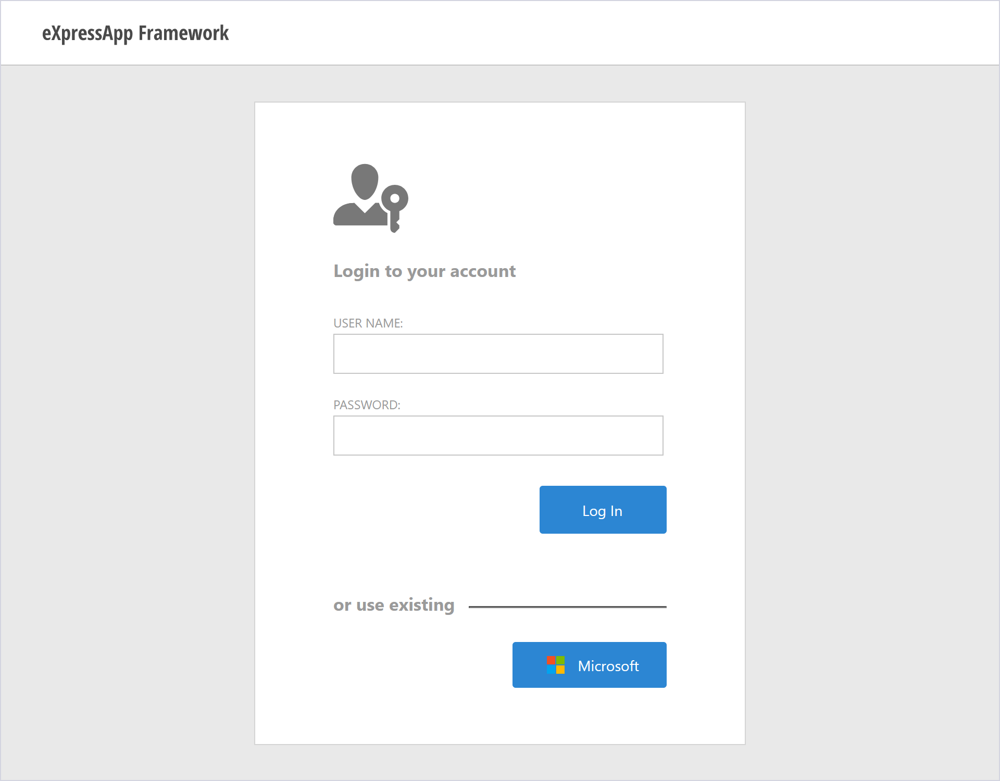

<!-- default badges list -->

<!-- default badges end -->

# XAF ASP.NET Web Forms - Use OAuth2 Authentication Providers

This example demonstrates how to extend your ASP.NET Web Forms application with OAuth authentication providers. Users can sign in to the application with their [Microsoft](https://learn.microsoft.com/en-us/azure/active-directory/develop/tutorial-v2-asp-webapp) accounts. Refer to the following article to learn how to add more authentication providers: [OWIN OAuth 2.0 Authorization Server](https://docs.microsoft.com/en-us/aspnet/aspnet/overview/owin-and-katana/owin-oauth-20-authorization-server).

See the following help topic for more information: [OAuth2 Authentication Providers in ASP.NET Web Forms Applications](https://docs.devexpress.com/eXpressAppFramework/403582/data-security-and-safety/security-system/authentication/oauth2-authentication-providers-in-web-forms-applications).

## Files to Review

* [LogonAuthController.cs](./MySolution.Module.Web/Controllers/LogonAuthController.cs)
* [CustomSecurityStrategyComplex.cs](./MySolution.Module.Web/Security/CustomSecurityStrategyComplex.cs)
* [ApplicationUser.cs](./MySolution.Module/BusinessObjects/ApplicationUser.cs)
* [CustomAuthenticationStandardProvider.cs](./MySolution.Module/Security/CustomAuthenticationStandardProvider.cs)
* [OAuthProvider.cs](./MySolution.Web/Security/OAuthProvider.cs)
* [Startup.cs](./MySolution.Web/Startup.cs)
* [WebApplication.cs](./MySolution.Web/WebApplication.cs)

## Documentation

* [Security (Access Control & Authentication)](https://docs.devexpress.com/eXpressAppFramework/113366/data-security-and-safety/security-system)
* [Authentication](https://docs.devexpress.com/eXpressAppFramework/119064/data-security-and-safety/security-system/authentication)
* [Tutorial: Add sign-in to Microsoft to an ASP.NET web app](https://learn.microsoft.com/en-us/azure/active-directory/develop/tutorial-v2-asp-webapp)
* [4 ways of adding your application to Azure Active Directory](https://techcommunity.microsoft.com/t5/azure-developer-community-blog/4-ways-of-adding-your-application-to-azure-active-directory/ba-p/336369)

## More Examples

* [Use Active Directory and OAuth2 Authentication Providers in Blazor Applications](https://docs.devexpress.com/eXpressAppFramework/402197/task-based-help/security/how-to-use-active-directory-and-oauth2-authentication-providers-in-blazor-applications)
* [Active Directory and OAuth2 Authentication Providers in WinForms Applications](https://docs.devexpress.com/eXpressAppFramework/404752/data-security-and-safety/security-system/authentication/oauth-and-custom-authentication/active-directory-and-oauth2-authentication-providers-in-winforms-applications)
